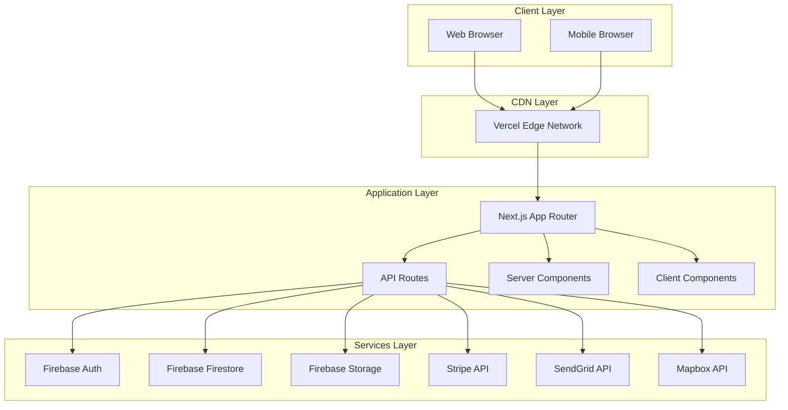
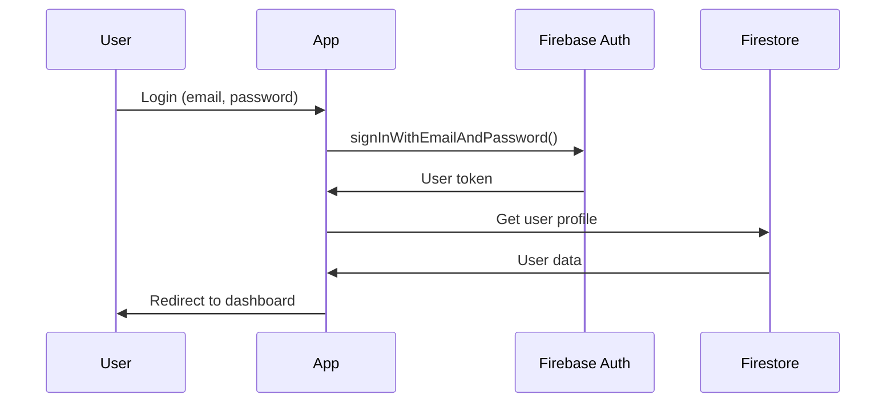
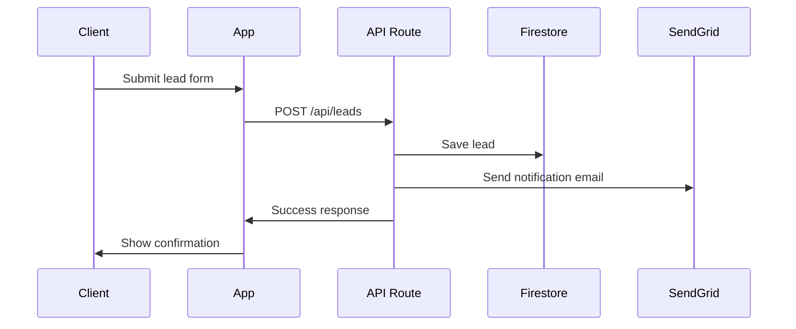
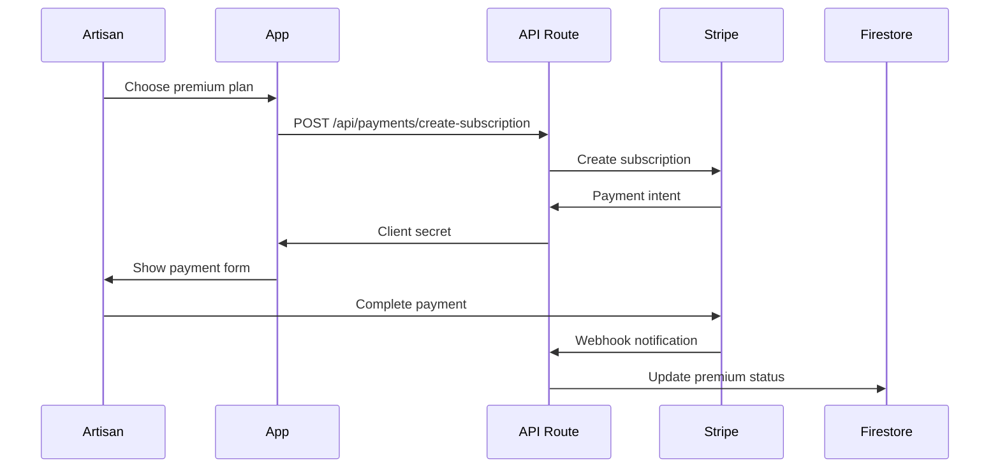

# 🏗️ Architecture Portail Habitat

Documentation de l'architecture technique du projet.

## 📋 Table des matières

- [🎯 Vue d'ensemble](#-vue-densemble)
- [🏗️ Architecture système](#️-architecture-système)
- [📁 Structure des dossiers](#-structure-des-dossiers)
- [🔄 Flux de données](#-flux-de-données)
- [🎨 Architecture frontend](#-architecture-frontend)
- [⚡ Architecture backend](#-architecture-backend)
- [💾 Architecture base de données](#-architecture-base-de-données)
- [🔐 Sécurité](#-sécurité)
- [📈 Scalabilité](#-scalabilité)

## 🎯 Vue d'ensemble

Portail Habitat est une application web moderne construite avec Next.js 14, utilisant l'App Router et une architecture serverless.

### Principes architecturaux

- **Separation of Concerns** : Séparation claire entre UI, logique métier et données
- **Component-Driven** : Interface construite avec des composants réutilisables
- **API-First** : API REST bien définie pour toutes les interactions
- **Security by Design** : Sécurité intégrée dès la conception
- **Performance** : Optimisations pour les Core Web Vitals

## 🏗️ Architecture système



### Stack technique

#### Frontend
- **Framework** : Next.js 14 (App Router)
- **Language** : TypeScript
- **Styling** : Tailwind CSS + shadcn/ui
- **State Management** : React Hooks + Context
- **Forms** : React Hook Form + Zod
- **Icons** : Lucide React

#### Backend
- **Runtime** : Node.js (Vercel Serverless)
- **API** : Next.js API Routes
- **Authentication** : Firebase Auth
- **Database** : Firebase Firestore
- **File Storage** : Firebase Storage
- **Email** : SendGrid
- **Payments** : Stripe

#### Infrastructure
- **Hosting** : Vercel
- **CDN** : Vercel Edge Network
- **DNS** : Cloudflare
- **Monitoring** : Vercel Analytics + Sentry

## 📁 Structure des dossiers

```
portailhabitat/
├── app/                          # Next.js App Router
│   ├── (auth)/                   # Route group - Authentification
│   │   ├── login/
│   │   └── register/
│   ├── admin/                    # Interface d'administration
│   │   ├── artisans/
│   │   ├── leads/
│   │   └── stats/
│   ├── artisans/                 # Pages publiques artisans
│   │   ├── page.tsx              # Liste des artisans
│   │   ├── [slug]/               # Profil artisan
│   │   └── ArtisansClient.tsx
│   ├── dashboard/                # Dashboard artisan
│   │   ├── profile/
│   │   ├── leads/
│   │   └── premium/
│   ├── api/                      # API Routes
│   │   ├── artisans/
│   │   ├── leads/
│   │   ├── payments/
│   │   └── webhooks/
│   ├── globals.css               # Styles globaux
│   ├── layout.tsx                # Layout racine
│   └── page.tsx                  # Page d'accueil
├── components/                   # Composants React
│   ├── ui/                       # Composants shadcn/ui
│   │   ├── button.tsx
│   │   ├── card.tsx
│   │   └── ...
│   ├── admin/                    # Composants admin
│   │   ├── ArtisansManagement.tsx
│   │   └── PremiumSwitch.tsx
│   ├── forms/                    # Formulaires
│   │   ├── LeadForm.tsx
│   │   └── ProfileForm.tsx
│   ├── Header.tsx                # Navigation
│   ├── Footer.tsx                # Pied de page
│   └── TopArtisanBadge.tsx       # Badge premium
├── lib/                          # Utilitaires et configuration
│   ├── firebase.ts               # Configuration Firebase
│   ├── stripe.ts                 # Configuration Stripe
│   ├── utils.ts                  # Utilitaires généraux
│   ├── validations.ts            # Schémas Zod
│   ├── premium-utils.ts          # Logique premium
│   └── artisan-filtering-algorithm.ts
├── hooks/                        # Custom React Hooks
│   ├── useAuth.ts                # Authentification
│   ├── useToast.ts               # Notifications
│   └── usePremium.ts             # Fonctionnalités premium
├── types/                        # Définitions TypeScript
│   ├── artisan.ts
│   ├── lead.ts
│   └── user.ts
├── public/                       # Assets statiques
│   ├── images/
│   ├── icons/
│   └── favicon.ico
└── .windsurf/                    # Documentation technique
    ├── SCHEMA_FIRESTORE.md       # Schéma base de données
    └── STORAGE.md                # Structure Firebase Storage
```

## 🔄 Flux de données

### Authentification



### Création de lead



### Activation premium



## 🎨 Architecture frontend

### Composants

```
App
├── Layout
│   ├── Header
│   │   ├── Navigation
│   │   └── UserMenu
│   └── Footer
├── Pages
│   ├── HomePage
│   ├── ArtisansPage
│   │   ├── SearchFilters
│   │   ├── ArtisanCard
│   │   └── Pagination
│   └── ArtisanProfile
│       ├── ArtisanBanner
│       ├── BannerVideoManager
│       └── ReviewsList
└── Providers
    ├── AuthProvider
    ├── ToastProvider
    └── ThemeProvider
```

### State Management

- **Global State** : React Context pour l'authentification
- **Local State** : useState/useReducer pour les composants
- **Server State** : SWR/React Query (à venir)
- **Form State** : React Hook Form

### Routing

- **App Router** : Next.js 14 file-based routing
- **Dynamic Routes** : `[slug]` pour les profils artisans
- **Route Groups** : `(auth)` pour l'authentification
- **Parallel Routes** : `@modal` pour les modales

## ⚡ Architecture backend

### API Routes

```
/api/
├── artisans/
│   ├── route.ts              # GET, POST
│   ├── [id]/
│   │   ├── route.ts          # GET, PUT, DELETE
│   │   └── premium/route.ts  # POST
│   └── search/route.ts       # GET
├── leads/
│   ├── route.ts              # POST
│   └── [artisanId]/route.ts  # GET
├── payments/
│   ├── create-subscription/route.ts
│   └── cancel-subscription/route.ts
└── webhooks/
    ├── stripe/route.ts
    └── sendgrid/route.ts
```

### Middleware

```typescript
// middleware.ts
export function middleware(request: NextRequest) {
  // Authentication check
  // Rate limiting
  // CORS headers
  // Security headers
}
```

### Services

```
lib/
├── services/
│   ├── artisan.service.ts    # CRUD artisans
│   ├── lead.service.ts       # Gestion leads
│   ├── payment.service.ts    # Intégration Stripe
│   ├── email.service.ts      # Envoi emails
│   └── storage.service.ts    # Upload fichiers
├── utils/
│   ├── validation.ts         # Validation données
│   ├── auth.ts              # Helpers auth
│   └── error.ts             # Gestion erreurs
└── types/
    ├── api.ts               # Types API
    └── database.ts          # Types DB
```

## 💾 Architecture base de données

### Collections Firestore

```
firestore/
├── artisans/                 # Profils artisans
│   └── {artisanId}/
│       ├── profile data
│       ├── premiumFeatures/
│       └── subcollections/
│           ├── leads/
│           ├── reviews/
│           └── posts/
├── users/                    # Utilisateurs clients
│   └── {userId}/
│       └── profile data
├── leads/                    # Demandes de devis
│   └── {leadId}/
│       └── lead data
├── reviews/                  # Avis clients
│   └── {reviewId}/
│       └── review data
└── posts/                    # Mur chantier
    └── {postId}/
        └── post data
```

### Indexes

```javascript
// Indexes composites nécessaires
artisans: [city, profession]
artisans: [profession, isPremium]
leads: [artisanId, status, createdAt]
reviews: [artisanId, createdAt]
posts: [isPublished, createdAt]
```

### Règles de sécurité

```javascript
// Exemple de règles Firestore
rules_version = '2';
service cloud.firestore {
  match /databases/{database}/documents {
    // Lecture publique, écriture authentifiée
    match /artisans/{artisanId} {
      allow read: if true;
      allow write: if isOwnerOrAdmin(artisanId);
    }
    
    // Accès restreint aux données utilisateur
    match /users/{userId} {
      allow read, write: if isOwnerOrAdmin(userId);
    }
  }
}
```

## 🔐 Sécurité

### Authentification

- **Firebase Auth** : Gestion des utilisateurs
- **JWT Tokens** : Authentification stateless
- **Role-based Access** : Contrôle des permissions
- **Session Management** : Cookies sécurisés

### Autorisation

```typescript
// Middleware d'autorisation
export async function requireAuth(req: NextRequest) {
  const token = getTokenFromHeader(req);
  const user = await verifyToken(token);
  
  if (!user) {
    throw new UnauthorizedError();
  }
  
  return user;
}

export async function requireRole(role: UserRole) {
  return async (req: NextRequest) => {
    const user = await requireAuth(req);
    
    if (user.role !== role) {
      throw new ForbiddenError();
    }
    
    return user;
  };
}
```

### Validation

```typescript
// Validation avec Zod
const CreateLeadSchema = z.object({
  artisanId: z.string().uuid(),
  projectType: z.string().min(1).max(100),
  description: z.string().min(10).max(1000),
  budget: z.enum(['0-5000', '5000-15000', '15000+']),
  contactInfo: z.object({
    firstName: z.string().min(1),
    lastName: z.string().min(1),
    email: z.string().email(),
    phone: z.string().regex(/^(\+33|0)[1-9](\d{8})$/)
  })
});
```

### Headers de sécurité

```typescript
// next.config.js
const securityHeaders = [
  {
    key: 'X-Frame-Options',
    value: 'DENY'
  },
  {
    key: 'X-Content-Type-Options',
    value: 'nosniff'
  },
  {
    key: 'Referrer-Policy',
    value: 'origin-when-cross-origin'
  },
  {
    key: 'Strict-Transport-Security',
    value: 'max-age=31536000; includeSubDomains'
  }
];
```

## 📈 Scalabilité

### Performance

- **Server Components** : Rendu côté serveur par défaut
- **Code Splitting** : Chargement à la demande
- **Image Optimization** : Next/Image avec WebP
- **Caching** : Cache Vercel + SWR
- **Bundle Analysis** : Optimisation des bundles

### Monitoring

```typescript
// Métriques personnalisées
export function trackEvent(name: string, properties: any) {
  // Google Analytics
  gtag('event', name, properties);
  
  // Sentry breadcrumb
  Sentry.addBreadcrumb({
    message: name,
    data: properties,
    level: 'info'
  });
}
```

### Limites et quotas

- **Firestore** : 1M lectures/jour (gratuit)
- **Storage** : 5GB (gratuit)
- **Vercel** : 100GB bandwidth/mois
- **Stripe** : Pas de limite de transactions

### Stratégies de mise à l'échelle

1. **Horizontal Scaling** : Serverless par défaut
2. **Database Sharding** : Par région géographique
3. **CDN** : Distribution globale des assets
4. **Caching** : Redis pour les données fréquentes
5. **Background Jobs** : Cloud Functions pour les tâches lourdes

---

## 🔄 Évolution de l'architecture

### Prochaines étapes

1. **Microservices** : Extraction des services métier
2. **Event Sourcing** : Historique des événements
3. **CQRS** : Séparation lecture/écriture
4. **GraphQL** : API plus flexible
5. **PWA** : Application mobile native

### Considérations techniques

- **Migration progressive** : Pas de big bang
- **Backward compatibility** : Maintien des APIs
- **Feature flags** : Déploiement graduel
- **A/B Testing** : Validation des changements

---

*Documentation mise à jour le 12 décembre 2025*
